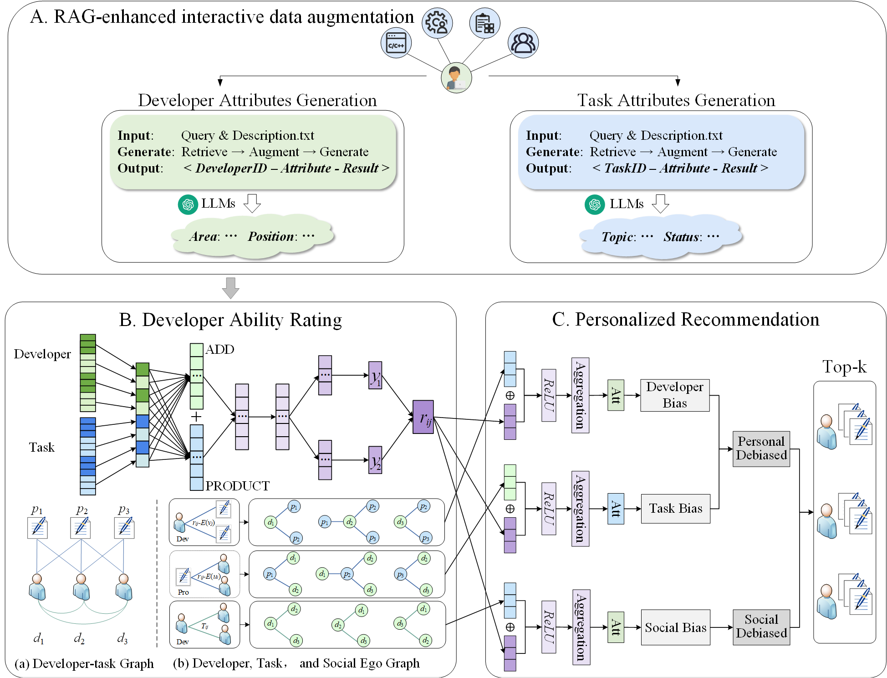
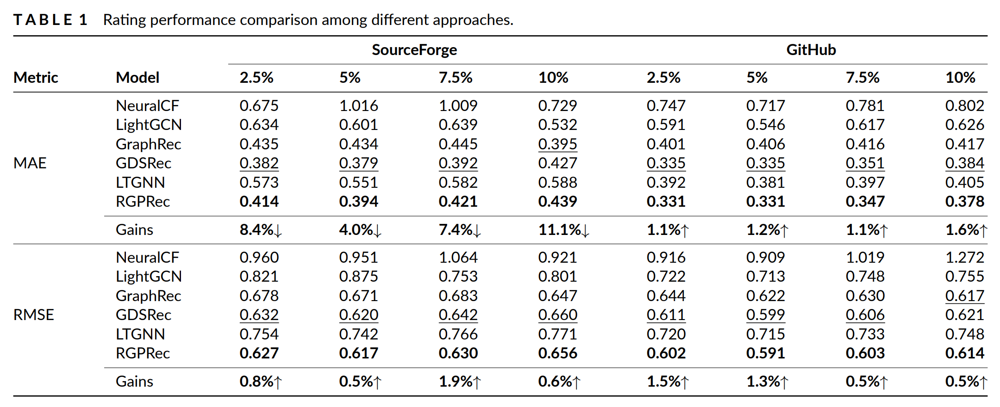

# RGPRec

---
This repository contains the implementation of RGPRec, a RAG‐enhanced GNN for personalized task recommendations in open-source communities such as SourceForge and GitHub.

## Model Overview
The RGPRec framework consists of three main components:

- RAG-enhanced Interactive Data Augmentation:
Retrieves relevant project documents and uses LLMs to generate developer/task attributes.

- Developer Ability Rating:
Employs multi-label neural networks to predict each developer's rating for tasks based on historical behavior and semantic features.

- Personalized Recommendation:
Constructs ego graphs for each developer to perform localized reasoning and generate debiased rating scores.



---

## Main Results


---

## Project Structure

```
RGPRec/
│
├── RGPRec-RAG/          # Raw data and RAG‐enhanced interactive data augmentation
├── RGPRec-Ability/      # Developer ability rating
├── RGPRec-Ego/          # Personalized recommendation and evaluation
└── requirements.txt     # Python dependencies
```

---

## Project Setup

### Environment Setup

Please use the following commands to create and activate the environment:

```bash
conda create -n RGPRec python=3.6
conda activate RGPRec
pip install -r requirements.txt
```

### Quick Test
To quickly test RGPRec without training, simply run:

```bash
cd RGPRec-Ego
python main-rank.py
```

### Train from Scratch 
If you'd like to retrain the model or reproduce our experimental results, follow these steps:

Step 1: Data Preparation

- The raw data of SourceForge and GitHub is provided in the `RGPRec-RAG/Tensorflow_raw/` and `RGPRec-RAG/SourthForge_raw/` folders.
- Please configure the APIs for GPT-4o and text-embedding-ada-002, and obtain the Developer and task Attributes through Cherry Studio(https://github.com/CherryHQ/cherry-studio).

Step 2: Ability Rating

- Run ability rating using:
```bash
cd RGPRec-Ability
python RGPRecA.py
```
This will generate ability scores and save them.

Step 3: Recommendation Model Training & Evaluation

- Train and evaluate the main recommendation model:
```bash
cd ../RGPRec-Ego
python main.py --dataset_path ../RGPRec-Ability/dataA_result/Tensorflow/ --data ../RGPRec-Ability/dataA_result/Tensorflow
```
- For ranking-based evaluation:
```bash
python main-rank.py --dataset_path ../RGPRec-Ability/dataA_result/Tensorflow/ --data ../RGPRec-Ability/dataA_result/Tensorflow
```

